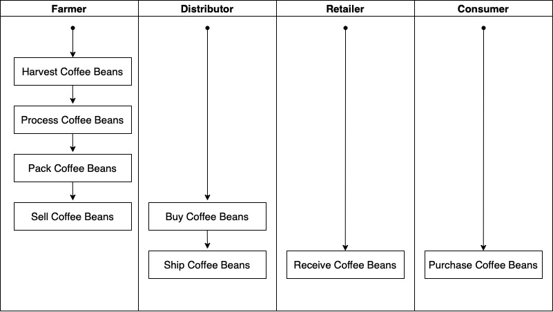
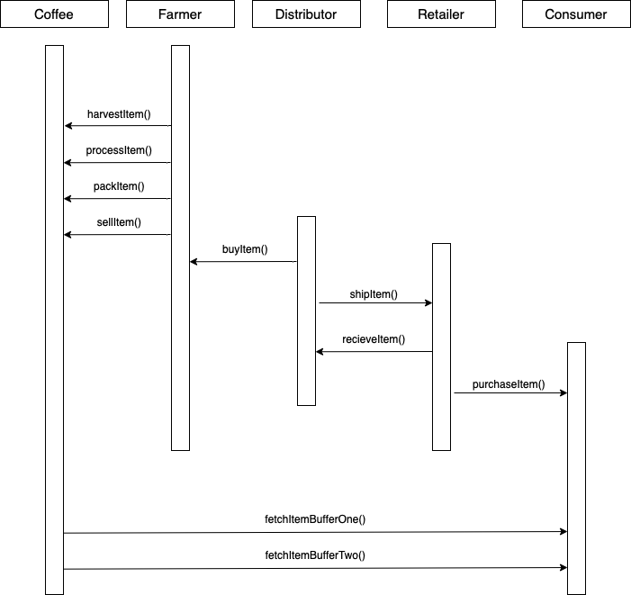
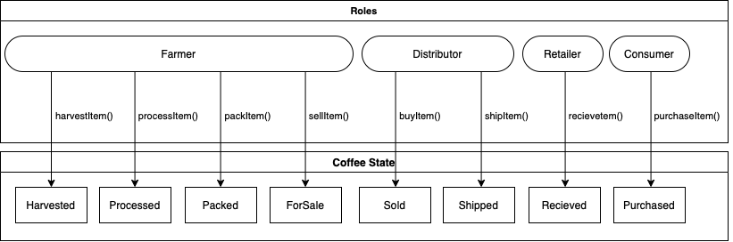
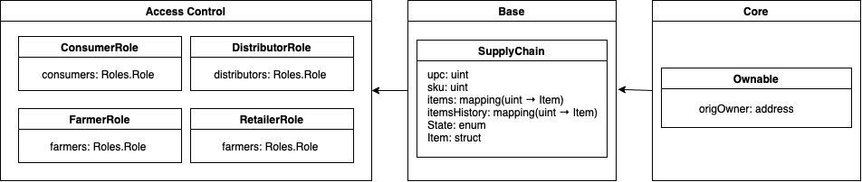

## Project Accomplishment

### UML Documents

1. Activity

   

2. Sequence

   

3. State

   

4. Data Model

   

### Deployed Contract

- [Contract](https://rinkeby.etherscan.io/address/0xadcf29d8a372d390f05bb4d48a3f60e793291b03)

### Packages

- truffle-hdwallet-provider: to configure network through infura
- web3: to interact with ethereum over HTML

### Versions

- Truffle v4.1.14 (core: 4.1.14)
- Solidity v0.4.24 (solc-js)
- Node v10.24.1
- npm '6.14.12'
